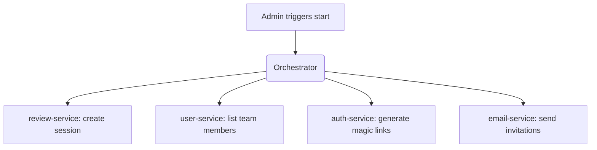
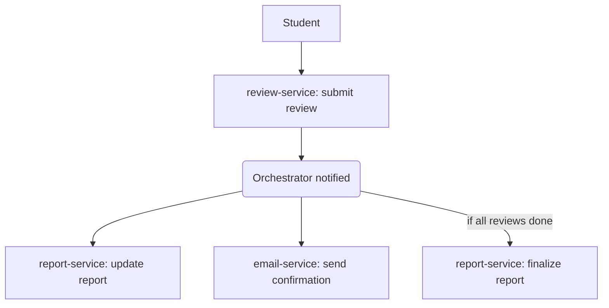

# Peerit – Architecture & Technical Overview

This document describes the redesigned architecture of the Peerit peer review platform. It adopts a microservice approach with a lightweight orchestrator to manage workflows across decoupled services.

## Architectural Goals

- Clear separation of concerns using domain-driven service boundaries
- Centralized coordination of workflows via a lightweight orchestrator
- Stateless, independently deployable services
- Strong security, privacy, and immutability guarantees
- Database abstraction to allow technology flexibility (PostgreSQL, MySQL, etc.)

## Microservice Breakdown

| Service          | Responsibilities                                                                 | Owns Data? |
|------------------|-----------------------------------------------------------------------------------|------------|
| auth-service     | Login, session management (email/password, magic-link), token issuing            | Yes        |
| user-service     | Manage users and roles (student, admin)                                          | Yes        |
| team-service     | Teams, projects, team-to-user assignments                                         | Yes        |
| rubric-service   | Manage question sets, versions, scoring weights                                  | Yes        |
| review-service   | Handle review session state, submission, validation                              | Yes        |
| report-service   | Aggregation, PDF/CSV generation, scoring summaries                               | Yes        |
| email-service    | Send emails (invitations, reminders, confirmations)                              | Yes        |
| orchestrator     | Trigger coordinated workflows across services (review session start, submit)     | No         |

## Workflow Examples

### Start Review Session


### Student Submits Review


### System Overview
```mermaid
flowchart TB
    subgraph Frontend
        FE[Browser UI]
    end

    subgraph Infrastructure
        APIGW[API Gateway (Caddy)]
        ORCH[Orchestrator]
    end

    subgraph Microservices
        AUTH[auth-service]
        USER[user-service]
        TEAM[team-service]
        RUBRIC[rubric-service]
        REVIEW[review-service]
        REPORT[report-service]
        EMAIL[email-service]
    end

    subgraph External
        SMTP[Email Server]
        DB[(PostgreSQL / MySQL)]
    end

    FE --> APIGW
    APIGW --> ORCH

    ORCH --> AUTH
    ORCH --> USER
    ORCH --> TEAM
    ORCH --> RUBRIC
    ORCH --> REVIEW
    ORCH --> REPORT
    ORCH --> EMAIL

    EMAIL --> SMTP

    AUTH --> DB
    USER --> DB
    TEAM --> DB
    RUBRIC --> DB
    REVIEW --> DB
    REPORT --> DB
    EMAIL --> DB
```

## Security Principles

- All services enforce role-based access (admin, student)
- Auth-service issues signed JWTs for frontend and service communication
- No cross-service DB access
- Anonymous peer reviews (only admin can audit reviewer identity)
- Immutability of reviews once submitted

## API Gateway

Use Caddy as the API gateway for request routing, HTTPS, and authentication forwarding. Caddy is easy to deploy in Kubernetes and supports automatic TLS and reverse proxy configuration via declarative files.

## Data Management

- One logical database per service (PostgreSQL by default)
- Each service abstracts persistence behind its own repository/interface layer
- Database engine should be swappable (e.g. MySQL-compatible schema + ORM or query layer)
- No foreign key constraints between services
- Denormalized reporting data to preserve immutability

## Development & Deployment

- Docker-based development environment
- Docker Compose for local orchestration
- Optional Kubernetes deployment later (Helm, K3s, etc.)
- CI/CD pipeline per service

## Summary

This architecture provides a clean separation of concerns while enabling end-to-end workflows using a lightweight orchestrator. Data access is isolated and swappable, services are stateless, and workflows are easy to extend or test. Where possible, open source components (e.g., Caddy as gateway) are reused rather than custom built.

## Future Scope

- Event bus integration for decoupled orchestration (e.g., Apache Kafka)
- Durable workflows using Temporal.io or AWS Step Functions
- Self-assessment feature (definite)
- LMS integrations (e.g., Canvas)
- Reviewer calibration scoring

