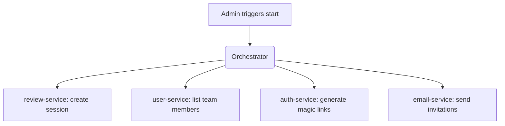
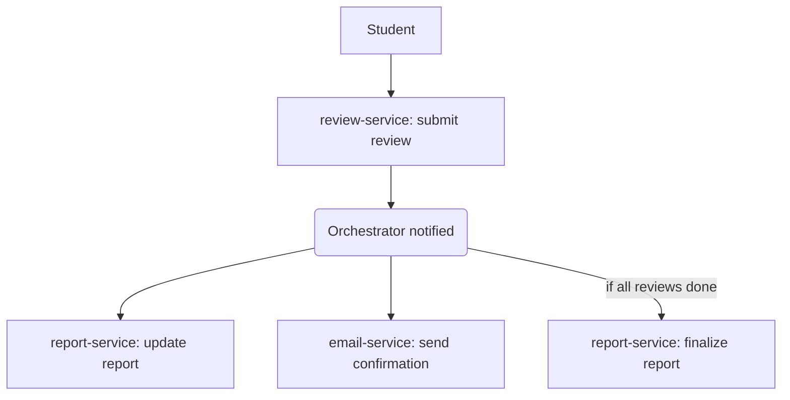

# Peerit – Requirements and Architecture Specification

This document outlines the functional requirements and technical architecture of **Peerit**, a platform to facilitate anonymous peer evaluation for student project teams. It combines a domain-driven microservice architecture with a streamlined user experience.

---

## Audience and Use Case

- **Audience**: Students (3–8 per team) doing long-term IT projects  
- **Admin**: Instructor or course staff  
- **Use case**: Students evaluate each other anonymously after a project or project phase.

---

## Architectural Goals

- Clear separation of concerns using domain-driven service boundaries
- Stateless, independently deployable microservices
- Lightweight orchestrator for workflow coordination
- Strong privacy, security, and immutability guarantees
- Anonymous and immutable peer reviews
- GDPR-aligned data handling
- Technology-agnostic persistence with PostgreSQL by default (MySQL-compatible)

---

## User Management

### User Accounts

- Managed internally (no external identity providers)
- Defined via CSV import: name, email, team
- Login options:
  - Email/password (securely hashed via bcrypt or argon2)
  - Magic-link login via email

### Roles

- Two roles: `admin` and `student`
- Admins manage users, teams, sessions, rubrics, and reports

---

## Team & Project Management

### Teams

- Each student is in exactly one team
- Defined via UI or CSV import

### Projects (Optional)

- Teams may be assigned to projects
- Multiple review sessions per project are allowed

---

## Rubric Management

### Rubrics (Question Sets)

- Admin defines question sets with:
  - Likert-scale questions (0–5)
  - Optional text response questions
  - Optional weights for scoring
- Rubrics are versioned
- Once assigned to a session, a rubric version is locked

### Default Rubric (Pre-seeded)

Likert-scale (0–5):

1. Contributed significantly to the project  
2. Met deadlines and commitments  
3. Collaborated effectively  
4. Communicated clearly  
5. Showed initiative  
6. Demonstrated technical skill  
7. Receptive to feedback  

Optional open-ended:

- What did this team member do particularly well?
- How could they improve?

Optional team reflection:

- Biggest challenge?
- How well did the team collaborate?

---

## Peer Review Workflow

### Review Sessions

- Admin initiates review session via UI
- Orchestrator coordinates:
  - Session creation (`review-service`)
  - Team member lookup (`user-service`)
  - Magic link generation (`auth-service`)
  - Email invitations (`email-service`)

### Review Process

- Students receive unique anonymous links
- Students evaluate all teammates
- Admins can track submission status but not content

### Deadlines & Reminders

- Deadlines are enforced
- Email reminders sent via `email-service` to incomplete reviewers

---

## Reports & Results

### Individual Reports

- Generated after session closes
- `report-service` compiles:
  - Anonymous comments
  - Score profile (e.g., spider chart)
- Reports are immutable post-generation

### Admin Access

- Admins can:
  - View/export reports
  - Track submission status
  - Export scores/comments (CSV, PDF)

---

## Admin Dashboard

- User and team management (CSV + UI)
- Rubric management
- Review session control and tracking
- Report viewing/exporting
- Reminder email controls

---

## Privacy & Security

- Reviews are anonymous
- Passwords are securely hashed
- Review data is immutable post-submission
- GDPR-aligned data handling
- Auth-service issues signed JWTs for access control
- No cross-service DB access

---

## Technical Architecture Overview

### Component Overview

- **Frontend**: Reactive SPA (e.g. SvelteKit or Vue.js)
- **API Gateway**: Caddy (HTTPS, routing, authentication forwarding)
- **Backend-for-Frontend (BFF)**: Translates orchestrator responses into frontend-specific formats
- **Orchestrator**: Coordinates multi-step workflows across services
- **Microservices**:
  - `auth-service`: Login and session management
  - `user-service`: User/role management
  - `team-service`: Team and project mapping
  - `rubric-service`: Rubric definitions and versions
  - `review-service`: Submission and review state
  - `report-service`: Report generation
  - `email-service`: Email sending and reminders
- **Database**: One logical DB per service (PostgreSQL by default; MySQL-compatible schema)

### Data Management

- Each service abstracts its own persistence
- No foreign key constraints between services
- Denormalized data in `report-service` for immutability
- All services own and isolate their data

### Deployment

- Docker-based development
- Docker Compose for local orchestration
- Kubernetes-ready (e.g. Helm, K3s)
- CI/CD pipeline per service

---

## Workflows

### Start Review Session



### Submit Review



### System Diagram

```mermaid
flowchart TB
    subgraph Frontend
        FE[Reactive SPA (SvelteKit/Vue)]
    end

    subgraph Gateway Layer
        CADDY["API Gateway - Caddy"]
        BFF["Backend-for-Frontend"]
    end

    subgraph Infrastructure
        ORCH[Orchestrator]
    end

    subgraph Microservices
        AUTH[auth-service]
        USER[user-service]
        TEAM[team-service]
        RUBRIC[rubric-service]
        REVIEW[review-service]
        REPORT[report-service]
        EMAIL[email-service]
    end

    subgraph External
        SMTP[Email Server]
        DB["PostgreSQL / MySQL"]
    end

    FE --> CADDY --> BFF --> ORCH
    ORCH --> AUTH
    ORCH --> USER
    ORCH --> TEAM
    ORCH --> RUBRIC
    ORCH --> REVIEW
    ORCH --> REPORT
    ORCH --> EMAIL

    EMAIL --> SMTP

    AUTH --> DB
    USER --> DB
    TEAM --> DB
    RUBRIC --> DB
    REVIEW --> DB
    REPORT --> DB
    EMAIL --> DB
```

---

## Future Scope

- Self-assessment
- Multi-phase reviews (e.g., midterm + final)
- Reviewer quality scoring
- Conflict detection & team dynamics insights
- LMS integrations (e.g., Canvas)
- Event bus (Kafka) or workflow engines (Temporal.io / Step Functions)
